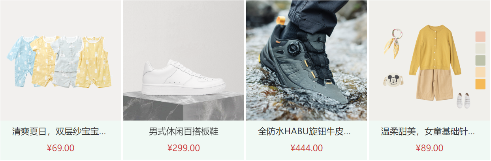
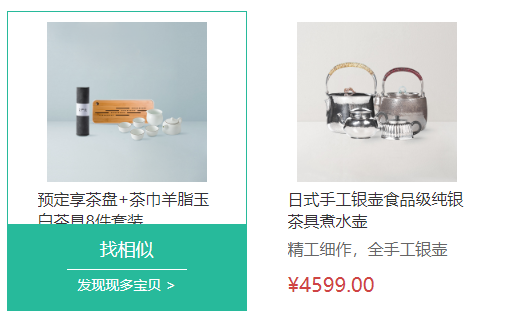

#### 1.布局总结

- list 图文

~~~html
<ul>
        <li>
          
          

            
【定金购】严选零食大礼包（12件）

            

            

          

        </li>
 </ul>
~~~

- 轮播图

  ~~~vue
  <template>
    

      <ul class="carousel-body" v-if="list && list.length">
        <li class="carousel-item" v-for="(slide,i) in list" :key="slide.id" :class="{fade: index === i}">
          <router-link to="/">
            
          </router-link>
        </li>
      </ul>
      <!-- 左右箭头 -->
      <a href="javascript:;" class="carousel-btn prev"><i class="iconfont icon-angle-left"></i></a>
      <a href="javascript:;" class="carousel-btn next"><i class="iconfont icon-angle-right"></i></a>
      <!-- 指示器 -->
      

        
      

    

  </template>
  
  
  ~~~

- list 图文2

  

~~~vue
<ul class="goods-list">
        <li v-for="item in goods" :key="item.id">
          <RouterLink :to="`/product/${item.id}`">
            
            
{{item.name}}

            
&yen;{{item.price}}

          </RouterLink>
        </li>
      </ul>
~~~

- 图文布局3

  

  ~~~html
  <!-- 单个item -->
  

      <RouterLink to="/" class="image">
        
      </RouterLink>
      
美威 智利原味三文鱼排 240g/袋 4片装

      
海鲜年货

      
&yen;108.00

      

        <RouterLink to="/">
          找相似
          发现现多宝贝 &gt;
        </RouterLink>
      

    

  ~~~

  

~~~html
<!-- 左右布局   ，左边固定一个高度  ，右边每个为左边二分之一 加上 中间间隔高度，
右边每个li 设置一个margin-bottom  最后一排margin-bottom设置为0
-->

~~~

~~~vue
    

      

        <RouterLink to="/">
          
          

            

              看到撒娇的撒娇的凯撒就
              倒萨倒萨倒萨
            

            &yen;19.99起
          

        </RouterLink>
        

          <i class="iconfont icon-hart1"></i>100
          <i class="iconfont icon-see"></i>100
          <i class="iconfont icon-message"></i>100
        

      

    

~~~

