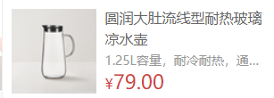

#### 1.布局总结

~~~html
<ul>
        <li>
          
          

            
【定金购】严选零食大礼包（12件）

            

            

          

        </li>
 </ul>
~~~

- 轮播图

  ~~~vue
  <template>
    

      <ul class="carousel-body" v-if="list && list.length">
        <li class="carousel-item" v-for="(slide,i) in list" :key="slide.id" :class="{fade: index === i}">
          <router-link to="/">
            
          </router-link>
        </li>
      </ul>
      <!-- 左右箭头 -->
      <a href="javascript:;" class="carousel-btn prev"><i class="iconfont icon-angle-left"></i></a>
      <a href="javascript:;" class="carousel-btn next"><i class="iconfont icon-angle-right"></i></a>
      <!-- 指示器 -->
      

        
      

    

  </template>
  
  
  ~~~

  