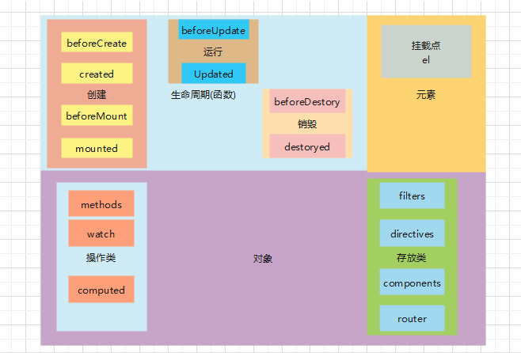
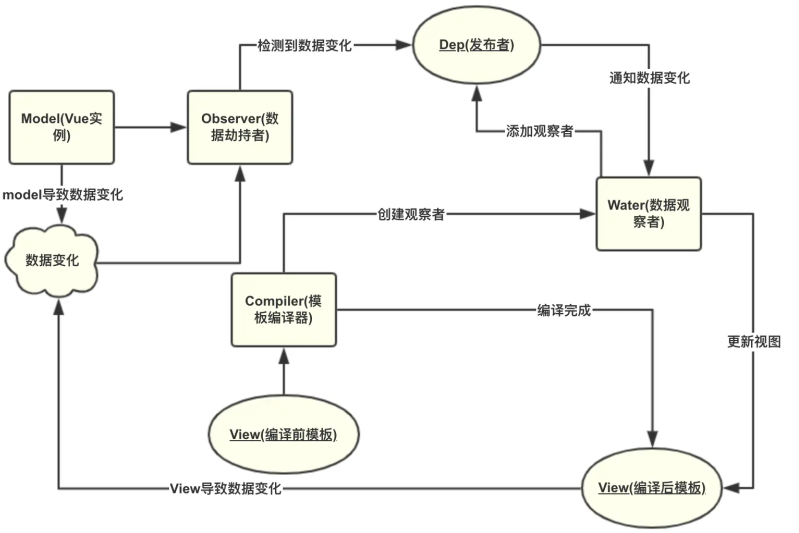

CSS篇

- flex 属性, flex-grow  flex-shrink  flex-basis

  - flex: auo === flex: 1 1 auto
  - flex: initial === flex: 0 1 auto
  - flex: none === flex: 0 0 auto

  - flex: 1  === flex : 1 1 0
  - flex:20px === flex-basis:20px
  - flex: 1 2 === flex-grow:1  flex-shrink:2
  - flex: 2 10% === flex-grow:2  flex-basis:10%
  - 拉伸因子和收缩因子，0表示不拉伸或者不收缩，同级元素比较谁大就优先拉伸和收缩谁


#### js篇

- undefined 数值转换为 NaN， null 转换为0

- 数据类型： 数字 字符 和 对象  ， 是否有无未定义； 另外还有Symbol
  1. 基本：Number  String  Boolean  Null  Undefinded  Symbol
  2. 引用： Object   函数  时间 等

- es5中isNaN() 和 es6中的Number.isNaN() 区别?

  - ~~~js
    isNaN(NaN)//true 
    isNaN(undefined) //true , 
    isNaN(true)// false;   
    
    Number.isNaN(NaN)// true ,
    Number.isNaN(undefined) //false   
    Number.isNaN(true)// false
    ~~~

- let 和 var的区别？

  1. 变量提升（先上车后买票）
  2. 局部作用域 （红杏出墙）
  3. 声明覆盖 

- 快速居中布局？

  ~~~html
  <!DOCTYPE html>
  <html lang="en">
  
  <head>
    <meta charset="UTF-8">
    <meta http-equiv="X-UA-Compatible" content="IE=edge">
    <meta name="viewport" content="width=device-width, initial-scale=1.0">
    <title>Document</title>
    <style>
      body,
      html {
        padding: 0;
        margin: 0;
        width: 100%;
        height: 100%;
      }
  
      body {
        display: flex;
  
      }
  
      .con {
        width: 200px;
        height: 200px;
        border: 1px solid #ccc;
        margin: auto;
      }
    </style>
  </head>
  
  <body>
    <div class="con">
      居中对齐
    </div>
  </body>
  
  </html>
  ~~~

- padding与margin？ padding对自己  margin对外

- vw与百分比区别？ 百分比有继承性相对父级，vw相对设备

- 字体变小？ transform:scale(0.8)

- 行内元素和块级元素？ 行类元素宽高由内容决定，设置宽高无效。

- 深拷贝和浅拷贝？

  1. 基本数据类型，值复制不存在深浅拷贝的说法

  2. 深拷贝主要针对对象和数组。浅拷贝只拷贝一层，拷贝后改变时对原来的对象影响

  3. 深拷贝的实现方式？

     ~~~javascript
     // 深拷贝对象和数组
     // 1. JSON方法
     JSON.parse(JSON.stringify(source))
     // 缺点， 关键字会失效 null ,function ,
     
     //2. 常用方法
     function deepClone(source){
         const targetObj = source.constructor === Array? []: {}
         
         for(let keys in source){
             if(source.hasOwnProperty(keys)){
                   if(source[keys] && typeof source[keys] === 'object'){
                   // 	targetObj[keys] = source[keys].constructor === Array? [] : {}
                      targetObj[keys] = deepClone(source[keys])
            	     }else{
                     // source[keys] 为基本数据类型
                     targetObj[keys] = source[keys]
                   }
             }
         }
         return targetObj
     }
     
     ~~~


- 数组操作方法中哪些会改变原数组？

  push，pop，shift， unshift， splice， reverse, sort,

- 输入url时发生了哪些？

  www 万维网，服务器； https 传输协议（在http和tcp之间加了一层TSL或者SSL的安全层）；url统一资源定位符，是IP的一个映射；ping是用来测试连接的；

  URL --> DNS域名系统-->拿到IP地址建立连接（TCP三次握手）-->拿数据，渲染页面 --> 四次挥手

  首次访问浏览器会将域名解析的IP存入本地中


- 从哪些点做性能优化？

  运算的效率对浏览器影响很小，不算性能优化

  1. 加载：

     ① 减少http请求次数（精灵图，文件合并）

     ② 减小文件体积（资源压缩，图片压缩，代码压缩）

     ③ CDN （第三方库，大文件，大图）

     ④ SSR服务端渲染，预渲染

     ⑤ 懒加载

  2. 性能：

     ① 减少dom操作，避免回流；文档碎片；

  3. 性能优化的几个方面：

     a. 页面加载性能

     b. 动画与操作性能（是否流畅卡顿）transform能脱离文档流减少回流

     c. 内存占用问题，浏览器崩溃

     d. 电量消耗


- 图片懒加载实现方式，原理？

  1. 可视区高度 + 滚动高  > 图片元素offsetTop；src 赋值。
  2.  document.documentElement.clientHeight + document.documentElement.scrollTop || document.body.scrollTop > imgs[i].offsetTop  

  ~~~javascript
    var num = document.getElementsByTagName('img').length;
    var img = document.getElementsByTagName("img");
    var n = 0; //存储图片加载到的位置，避免每次都从第一张图片开始遍历
    
    lazyload(); //页面载入完毕加载可是区域内的图片
    
    window.onscroll = lazyload;
    
    function lazyload() { //监听页面滚动事件
        var seeHeight = document.documentElement.clientHeight; //可见区域高度
        var scrollTop = document.documentElement.scrollTop || document.body.scrollTop; //滚动条距离顶部高度
        for (var i = n; i < num; i++) {
        if (img[i].offsetTop < seeHeight + scrollTop) {
            if (img[i].getAttribute("src") == "default.jpg") {
            img[i].src = img[i].getAttribute("data-src");
            }
            n = i + 1;
        }
        }
    }
  ~~~


- vue2中哪些是函数写法，哪些是对象写法？

  

  https://blog.csdn.net/layxing27/article/details/108986484

- this 指向问题？

  1. this指向上一层调用者

  2. 箭头函数没有this    指向外层

  3. 例子

     ~~~javascript
     // this 指向
     const j = {
         name: 'j',
         age: 10,
         b: {
             name: 'b',
             age: 8,
             fn: function(){
                console.log(this.name)  // b
             }
         }
     }
     
     // 箭头函数
     var  id = 55 // 必须是var
     function handle(){
         setTimeout(()=>{
             console.log(this.id)
         },500)
     }
     handle({id:22})  // 55
     
     // 怎么才能打印22 ？使用 call  apply  bind
     handle.call({id:22})
     ~~~

- call , apply bind区别？

    >都改变this指向 bind不调用
    >
    >call(传this，参数1, 参数2，...)
    >
    >bind(传this，参数1, 参数2，...)
    >
    >call(传this, [参数1， 参数2, ...])

- 闭包？

  - AO 和 VO；Activation Object, AO，有时也称活动对象、激活对象；Variable Object, VO，有时也称变量对象

  1. 闭包的作用？为什么要有闭包？

     ① 避免变量被污染

     ② 私有化

     ③ 保存变量  常驻内存

  2. 闭包应用场景？

     - 防抖， 节流， 库的封装(保证数据私有化)

  3. 一些闭包实例

     ~~~javascript
     // 立即执行函数不等同于闭包，闭包的通常写法是return一个函数
     (function () {
           let a = 1
           let b = 2
     
           function fn() { console.log(123)}
           return {
             fn,
             a
           }
         })()
     
     // 例子2
         let counterFn = function () {
           let privateCount = 0
           function changeCount(val) {
             privateCount += val
           }
           return {
             addCount: function () {
               changeCount(1)
             },
             minusCount: function () {
               changeCount(-1)
             },
             value: function () {
               return privateCount
             }
           }
         }
         let fn = counterFn() // 必须先保存这个函数
         fn.addCount()
         fn.addCount()
         fn.addCount()
         console.log(fn.value()) // 3
         /*
         *错误示范  这样改变不了privateCount的值
           counterFn().addCount()
           counterFn().addCount()
         */
     ~~~


- new 操作符做了哪些事？4个

  1. 创建了一个空对象

  2. 设置它的原型链

  3. 改变了this指向

  4. 判断返回值实例

     - 构造器函数默认返回一个对象

  5. 代码解析

     ~~~javascript
         function Person(){
           this.name = '张三',
           this.fn = function(){
             console.log(`名字叫${this.name}`)
           }
         }
         let p1 = new Person()
     
         // new 代码拆分-- 重要
         let obj = new Object()
         obj.__proto__ = Person.prototype
         let res =  Person.call(obj)
         if(typeof res === 'object'){
           p1 = res
         }else{
           p1 = obj
         }
     ~~~

- let a = Object.create(null) 和  let a = {} 有什么区别？

  Object.create(null)是单纯的对象  没有原型继承，在某些场景中运算效率更高

- vue 双向绑定的原理？

  采用 数据劫持+发布订阅模式； 通过 Object.defineProperty()劫持各个属性setter，getter

  数据变动发布消息 ，触发回调

  

- async 和 await 是什么？有什么作用？

- vue2 中的this.$emit('update:xx', value) 和 xx.sync 的用法？

  - 写法等价

    ~~~vue
    <hello-world :message="originStr" @update:message="changeMessage" />
    <hello-world :message.sync="originStr" />
    
    <script>
    	this.$emit('update:message', msgStr)
    </script>
    ~~~

  - [vue 中的 .sync 修饰符 与 this.$emit('update:key', value)](https://www.cnblogs.com/aimee2004/p/15776454.html)

  - 对一个 prop 进行“双向绑定”

- jquery操作checkbox选中中的坑， `使用prop方法设置属性值  而不使用attr方法`

- 移动端最佳适配解决方案? 淘汰rem  选用viewport

  >1vw等于视图单位的1%的宽度

  ><meta name="viewport" content="width=device-width,initial-scale=1.0,user-scalable=no">

  

  ~~~
  //引入 postcss-px-to-viewport
   npm install postcss-px-to-viewport --save-dev
  
  // 新建 postcss.config.js
  
  module.exports = {
    plugins: {
      'postcss-px-to-viewport': {
       unitToConvert: "px", // 要转化的单位       
       viewportWidth: 375, // UI设计稿的宽度       
       unitPrecision: 6, // 转换后的精度，即小数点位数       
       propList: [""], // 指定转换的css属性的单位，代表全部css属性的单位都进行转换     
       viewportUnit: "vw", // 指定需要转换成的视窗单位，默认vw       
       fontViewportUnit: "vw", // 指定字体需要转换成的视窗单位，默认vw      selectorBlackList: ["wrap"], // 指定不转换为视窗单位的类名，       
       minPixelValue: 1, // 默认值1，小于或等于1px则不进行转换       
       mediaQuery: true, // 是否在媒体查询的css代码中也进行转换，默认false      
       replace: true, // 是否转换后直接更换属性值       
       exclude: [/node_modules/], // 设置忽略文件，用正则做目录名匹配       
      }
    }
  }
  
  // 解决第三方组件库兼容问题
  
  vant组件库的设计稿是按照375px来开发的。因此在viewportWidth为750px时会出现转换问题。
  
    // postcss.config.js
  const path = require('path');
  
  module.exports = ({ webpack }) => {
    const viewWidth = webpack.resourcePath.includes(path.join('node_modules', 'vant')) ? 375 : 750;
    return {
      plugins: {
        autoprefixer: {},
        "postcss-px-to-viewport": {
          unitToConvert: "px",
          viewportWidth: viewWidth,
          unitPrecision: 6,
          propList: ["*"],
          viewportUnit: "vw",
          fontViewportUnit: "vw",
          selectorBlackList: [],
          minPixelValue: 1,
          mediaQuery: true,
          exclude: [],
          landscape: false
        }
      }
    }
  }  
  
  // 如果读取的node_modules中的文件是vant,那么就将设计稿变为375px。如果读取的文件不是vant的文件,那么就将设计稿变为750px。这样就可以避免vant组件在750px下出现样式缩小的问题了。
  
  // 其他的移动端UI组件库 修改这段代码即可
  
  const viewWidth = webpack.resourcePath.includes(path.join('node_modules', 'vant')) ? 375 : 750; 
  ~~~

  

  >//引入 postcss-px-to-viewport
  > npm install postcss-px-to-viewport --save-dev
  >
  >// 新建 postcss.config.js
  >
  >module.exports = {
  >  plugins: {
  >    'postcss-px-to-viewport': {
  >     unitToConvert: "px", // 要转化的单位       
  >     viewportWidth: 375, // UI设计稿的宽度       
  >     unitPrecision: 6, // 转换后的精度，即小数点位数       
  >     propList: ["*"], // 指定转换的css属性的单位，*代表全部css属性的单位都进行转换     
  >     viewportUnit: "vw", // 指定需要转换成的视窗单位，默认vw       
  >     fontViewportUnit: "vw", // 指定字体需要转换成的视窗单位，默认vw      selectorBlackList: ["wrap"], // 指定不转换为视窗单位的类名，       
  >     minPixelValue: 1, // 默认值1，小于或等于1px则不进行转换       
  >     mediaQuery: true, // 是否在媒体查询的css代码中也进行转换，默认false      
  >     replace: true, // 是否转换后直接更换属性值       
  >     exclude: [/node_modules/], // 设置忽略文件，用正则做目录名匹配       
  >    }
  >  }
  >}
  >
  >// 解决第三方组件库兼容问题
  >
  >vant组件库的设计稿是按照375px来开发的。因此在`viewportWidth`为`750px`时会出现转换问题。
  >
  >  // postcss.config.js
  >const path = require('path');
  >
  >module.exports = ({ webpack }) => {
  >  const viewWidth = webpack.resourcePath.includes(path.join('node_modules', 'vant')) ? 375 : 750;
  >  return {
  >    plugins: {
  >      autoprefixer: {},
  >      "postcss-px-to-viewport": {
  >        unitToConvert: "px",
  >        viewportWidth: viewWidth,
  >        unitPrecision: 6,
  >        propList: ["*"],
  >        viewportUnit: "vw",
  >        fontViewportUnit: "vw",
  >        selectorBlackList: [],
  >        minPixelValue: 1,
  >        mediaQuery: true,
  >        exclude: [],
  >        landscape: false
  >      }
  >    }
  >  }
  >}  
  >
  >// 如果读取的`node_modules`中的文件是`vant`,那么就将设计稿变为375px。如果读取的文件不是`vant`的文件,那么就将设计稿变为750px。这样就可以避免`vant`组件在750px下出现样式缩小的问题了。
  >
  >// 其他的移动端UI组件库 修改这段代码即可
  >
  >const viewWidth = webpack.resourcePath.includes(path.join('node_modules', 'vant')) ? 375 : 750; 
  >
  >

  

  

  

  

  

  ## vue 篇

  `问题一：   router、routes、route的区别`
  1.router：路由器对象（new的路由器对象），包含一些操作路由的功能函数，来实现编程式导航。一般指的是在任何组件内访问路由。如：路由编程式导航的$router.push()； $router.go()

  2.routes：指创建vue-router路由实例的配置项。用来配置多个route路由对象

  3.route：指路由对象表示当前激活的路由的状态信息。如：this.$route指的是当前路由对象，path/meta/query/params      如： $route.params.id 获取动态路由的id

   

  `问题二： vue-router中 props， query， params传递参数的区别？`

  命名式路由： 使用router-link创建a标签来定义导航链接； to属性为链接地址

   编程式路由： 借助router的实例方法，通过js代码来实现。

  1. params 传递

     - 路由的配置

       第一步： 使用routes参数设置路径

       ~~~js
       const routes = [
         // 动态段以冒号开始
         { path: 'details/:id', name: "details", component: Details },
       ]
       ~~~

       第二步：使用router.push()定义路径 ----  path,params 同时存在 ，则params会被忽略

       ~~~js
       const Home = {
         template: '<div @click="toDetails">To Details</div>',
         metheds: {
           toDetails() {
             // 字符串路径
             this.$router.push('/details/001')
             // 带有路径的对象
             this.$router.push({path: '/details/001'})
             // 命名路由，路由配置时，需要 name 字段
             this.$router.push({ name: 'details', params: { id: '001' } })
           }
         }
       }
       
       //  >>>> path,params 同时存在 ，则params会被忽略
       router.push(path:'/details'. params: {id: '001'}) // 结果只是 /details
       ~~~

     - 组件中的数据获取 `this.$route.params`

       ~~~js
       const Details = {
         template: '<div>Details {{ $route.params.id }} </div>',
         created() {
           // 监听路由变化
           this.$watch(
             () => this.$route.params,
             (toParams, previousParams) => {
               // 对路由变化做出响应...
             }
           )
         },
       }
       ~~~

       

  2. query传递  如：/details/001?kind=car

     - 路由配置

       第一步： 使用routes配置路由

       ~~~js
       const routes = [
         // 动态段以冒号开始
         { path: 'details/:id', name: "details", component: Details },
       ]
       ~~~

       第二部：使用router.push传递参数

       ~~~js
       this.$router.push('/details/001?kind=car')
       this.$router.push({ path: '/details/001', query: { kind: "car" }})
       this.$router.push({ name: 'details', params: { id: '001' }, query: { kind: 'car' }})
       ~~~

     - 组件中的数据获取 `this.$route.query`

       ~~~js
       const Details = {
         template: '<div>Details {{ $route.query.kind }} </div>',
         created() {
           // 监听路由变化
           this.$watch(
             () => this.$route.query,
             (toParams, previousParams) => {
               // 对路由变化做出响应...
             }
           )
         },
       }
       ~~~

  3. hash传递  如： /details/001#car

     - 路由配置

       ~~~js
       this.$router.push('/details/001#car')
       this.$router.push({ path: '/details/001', hash: '#car'})
       this.$router.push({ name: 'details', params: { id: '001' }, hash: 'car'})
       ~~~

     - 组件中的数据获取  `this.$route.hash.slice(1)`

       ```js
       const Details = {
         template: '<div>Details {{ $route.hash.slice(1) }} </div>',
       }
       ```

  4. props进行传递

     因为组件中使用$route 会和路由紧密耦合，使用props可以解耦

     第一种： 布尔模式

     - 路由配置

       ```js
       // 路由配置中，增加 props 字段，并将值 设置为 true
       const routes = [{ path: '/user/:id', component: User, props: true }]
       
       // 当有命名视图的路由，你必须为每个命名视图定义 props 配置：
       const routes = [
         {
           path: '/user/:id',
           components: { default: User, sidebar: Sidebar },
           // 为 User 提供 props
           props: { default: true, sidebar: false }
         }
       ]
       ```

     - 组件中的数据获取

       ```js
       const User = {
         props: ['id'], // 组件中通过 props 获取 id
         template: '<div>User {{ id }}</div>'
       }
       ```

     第二种： 对象模式   --- 静态参数时

     - 路由配置

       ````js
       const routes = [
         {
           path: '/hello',
           component: Hello,
           props: { name: 'World' }
         }
       ]
       ````

     - 组件中的数据获取

       ```js
       const Hello = {
         props: {
           name: {
             type: String,
             default: 'Vue'
           }
         },
         template: '<div> Hello {{ name }}</div>'
       }
       ```

     第三种： 函数模式

     可以创建一个返回 props 的函数。这允许你将参数转换为其他类型，将静态值与基于路由的值相结合等等。

     - 路由配置

       ~~~js
       // 创建一个返回 props 的函数
       const dynamicPropsFn = (route) => {
         return { name: route.query.say + "!" , id: route.params.id}
       }
       const routes = [
         {
           path: '/hello/:id',
           component: Hello,
           props: dynamicPropsFn
         }
       ]
       ~~~

       

     - 组件中的数据获取

       ~~~js
       //当 URL 为 /hello:001?say=World 时， 将传递 {name: 'World!',id:'001'} 作为 props 传给 Hello 组件。
       const Hello = {
         props: {
           name: {
             type: String,
             default: 'Vue'
           },
             id: String
         },
         template: '<div> Hello {{id}} -- {{ name }}</div>'
       }
       ~~~


