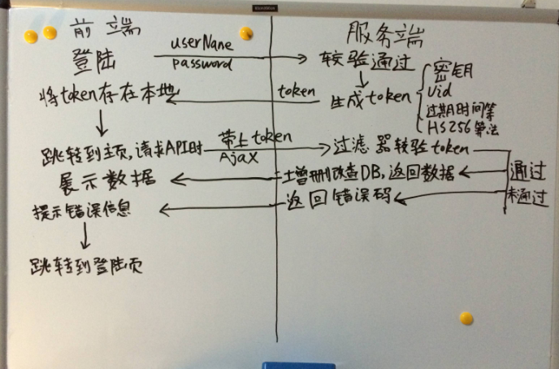

1. vuex中 dispatch  和 commit

   dispatch 推送一个action，

    commit 推送一个 mutation

2. string对象扩展一个方法删除前后空格

   ~~~javascript
   String.prototype.deletSpace = function(){
       let str = this
       while(str[0] === ' '){
           str = str.substring(1)
       }
       while(str[str.length -1] === ' '){
           str = str.substring(0,str.length -1)
       }
       return str
   }
   ~~~

   

3. webpack构建流程？

   ​    

4. 权限验证

   - 登录权限验证： 部分页面需要登录才能访问
   - 角色权限验证： 在登录权限的基础上加角色权限的验证，eg：同意页面不同角色展示内容板块不同

5. 正则表达式

- /^abc$/ 用于匹配的目标字符必须以a开头 c结尾

  str.match(reg), reg.exex(str)

- 匹配任意字符的写法： [^]* 或者 [\s\S]*

- 使用正则表达式的方法总结：
  1. 正则表达式方法： exec，test；eg: /^张三$/.exec(字符串)
  2. 字符串方法： match, matchAll, search, replace, split;  eg: 字符串.match(正则表达式)

6. vue中的书写易错点总结：
   1. vuex 中 设置命名空间属性为小写 namespaced: true

   2. store.commit('模块名/mutations名'，payload) 而不是 store.emit()

   3. 当使用父级hover控制子元素展开时，如果遇到父级包裹的情况，并且一定要使用到子级的opacity时 会出现放置在子元素也会触发父级hover的bug，所以需要使用`z-index`来控制；

   4. 一些写法

      ~~~vue
      
      ~~~

7. 返回空对象

   ~~~javascript
   () => ({}) // 箭头函数返回空对象写法
   ~~~

8. vue中需要传入函数作为参数，而传入的函数也需要传入参数时-- 处理方法

   ~~~vue
    
   ~~~

   

9. jquery 的实现代码？分两次优化例子

   - 基础版本

   ~~~javascript
   (function (window) {
     window.$ = jquery = function (selector) {
       // 存放node节点 
       let nodes = {}
       if (typeof selector === 'string') {
         let temp = document.querySelectorAll(selector)
         for (let i = 0; i < temp.length; i++) {
           nodes[i] = temp[i]
         }
   
         // 变成类数组
         nodes.length = temp.length
       } else {
         throw new Error('选择器必须为字符串')
       }
   
       nodes.addClass = function (classes) {
         let classNames = classes.split(' ')
         classNames.forEach(className => {
           for (let i = 0; i < nodes.length; i++) {
             nodes[i].classList.add(className)
           }
         })
       }
   
       nodes.text = function (text) {
         for (let i = 0; i < nodes.length; i++) {
           nodes[i].textContent = text
         }
       }
       // 返回节点 对象
       return nodes
     }
   })(window)
   ~~~

   - 优化版1

     ~~~javascript
     let $ = jQuery = (function (window) {
       let JQ = function (selector) {
         this.nodes = document.querySelectorAll(selector)
       }
     
       // 原型方法
       JQ.prototype = {
         each: function (callback) {
           for (let i = 0; i < this.nodes.length; i++) {
             // 传入第几个， 和node节点
             callback.call(this, i, this.nodes[i])
           }
         },
         addClass: function (classes) {
           classes.split(' ').forEach(className => {
             this.each(function (index, node) {
               node.classList.add(className)
             })
           });
         },
         setText: function (text) {
           this.each(function (index, node) {
             node.textContent = text
           })
         }
       }
     
       // 返回值
       return function (selector) {
         return new JQ(selector)
       }
     })(window)
     // 不支持链式调用
     ~~~

   - 优化2

     ~~~javascript
     let $ = jQuery = (function (window) {
       // dom存储
       function Query (dom, selector) {
         let i, len = dom ? dom.length : 0
         for (i = 0; i < len; i++) {
           this[i] = dom[i]
         }
         this.length = len
         this.selector = selector
         return this
       }
     
       // 生成jquery对象
       function Z (elements, selector) {
         return Query.call(this, elements, selector)
       }
     
       // 具体dom查找
       function qsa (element, selector) {
         return element.querySelectorAll(selector)
       }
     
       Z.prototype = {
         each (callback) {
           [].every.call(this, function (el, index) {
             return callback.call(el, index, el) !== false
           })
         },
         // 查找子元素
         find (selector) {
           let doms = []
           this.each(function (index, el) {
             let childs = this.querySelectorAll(selector)
             doms.push(...childs)
           })
           return new Z(doms, selector)
         },
         remove () {
           this.each(function (index, el) {
             this.remove()
           })
         }
       }
     
       // 全局方法
       function isFunction (value) {
         return typeof value === 'function'
       }
     
     
     
       // 需要返回的
       function $ (nodeSelector) {
         let doms = qsa(document, nodeSelector)
         return new Z(doms, nodeSelector)
       }
       $.isFunction = isFunction
       return $
     })(window)
     ~~~

     

