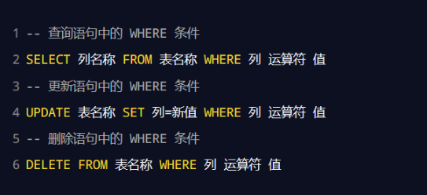
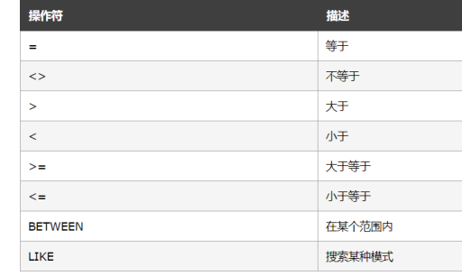
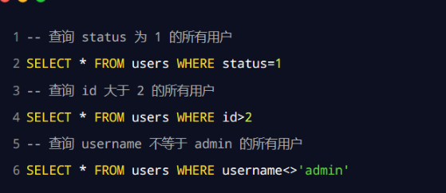

**查询数据（select） 、插入数据（insert into） 、更新数据（update） 、删除数据（delete）**

**where 条件、and 和 or 运算符、order by 排序、count(*) 函数**

- select 列名称1，列名称2 from 表名称
- insert into tablename(列1，列2，...) values (值1，值2，...)
- update 表名称 set 列名称=新值，列2=新值2 where 列名称=旧值
- delete from 表名称 where 列名称=值

**where 子句**-- 限定选择的标准

**运算符总结**

**在某些版本的 SQL 中，操作符 <> 可以写为 !=**

**sql中and和or运算符**

- select * from users where status=0 and id<3

**order by 子句**, 默认为升序排序

- ASC 升序 ，DESC 降序
- select * from users order by status DESC, username asc

**count(*)函数**，查询结果的总数居条数

- select count(*) from 表名
- selet count(*) from users where status=0

**as 为列设置别名**

- select count(*) as total from users where status=0

