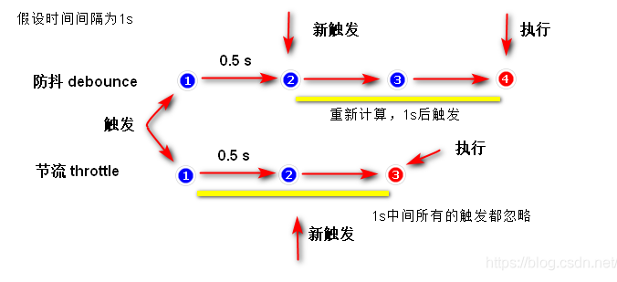

### 防抖和节流

#### 防抖

~~~javascript
// 防抖 -- 首次触发后在规定时间内未触发则时间到了就触发；如果再规定时间内触发了，就会再次延长规定时间后触发
// 应用场景：
//  search搜索联想；频繁操作点赞和取消点赞；获取最后一次操作
//  页面的滚动
// 限制 鼠标连击 触发
// 每次 resize/scroll 触发统计事件
// 文本输入的验证（连续输入文字后发送 AJAX 请求进行验证，验证一次就好）

/**
 * 
 * @param {Function} fn 
 * @param {Number} delay 延迟执行毫秒数
 * @param {Boolean} immediate true 表立即执行，false 表非立即执行
 * @returns 
 * 立即执行 是 触发事件后函数会立即执行，然后 n 秒内不触发事件才能继续执行函数的效果
 */
function debounce (fn, immediate, delay) {
  console.log('只调用了一次')
  // 标记定时器的返回值
  let timer = null  // 清空定时器  timer会被系统的垃圾回收机制回收
  return function () {
    if (timer) { // 每当用户触发时  把前一个定时器清除 clear 
      clearTimeout(timer) // 清除定时器 但是timer变量本身仍然存在
    }
    if (immediate) { // 立即执行
      let callnow = !timer // timer 不存在就会立即调用
      timer = setTimeout(() => {
        timer = null
      }, delay)
      if (callnow) {
        fn.apply(this, arguments)
      }
    } else {

      timer = setTimeout(() => { // 重新开启一个定时器重新计时
        fn.apply(this, arguments)
      }, delay)
    }
  }
~~~

#### 节流

~~~javascript
//  节流 -- 只看时间，时间到了才算一次有效触发;在 n 秒中只执行一次函数。节流会稀释函数的执行频率。
// 应用场景：
//  鼠标不断点击触发，mousedown 单位时间内只触发一次
// 射击游戏的 mousedown/keydown 事件（单位时间只能发射一颗子弹）
// 搜索联想（keyup）
// 监听滚动事件判断是否到页面底部自动加载更多：给 scroll 加了 debounce 后，只有用户停止滚动后，才会判断是否到了页面底部；如果是 throttle 的话，只要页面滚动就会间隔一段时间判断一次
// https://blog.csdn.net/weixin_45844049/article/details/118689247

// 方法一：利用时间戳实现
function throttle (fn, delay) {
  let previous = 0
  return function () {
    let now = new Date()
    if (now - previous > delay) {
      previous = now
      fn.apply(this, arguments)
    }
  }
}

// 方法二：利用定时器实现
function throttle_timer (fn, delay) {
  let timer = null
  return function () {
    if (!timer) { // timer 不存在
      timer = setTimeout(() => {
        timer = null // 回收定时器
        fn.apply(this, arguments)
      }, delay)
    }
  }
}
~~~

使用案例

~~~html
<!DOCTYPE html>
<html lang="en">

<head>
  <meta charset="UTF-8">
  <meta http-equiv="X-UA-Compatible" content="IE=edge">
  <meta name="viewport" content="width=device-width, initial-scale=1.0">
  <title>Document</title>
  
</head>

<body>
  

  
  
</body>

</html>
~~~

